EF — Reporte de Proyecto
Estudiante: Sofia Nicole Ugarte Salazar
Proyecto: Sistema de agenda psicologo
repositorio: https://github.com/nicoleUg/psicologo.git 
Fecha de entrega: 13/06/2026 

seccion 1 --deployment
URL del despliegue: https://psicologo.leleworks.dev/ 
url2 del despliegue:https://psicologoagenda.netlify.app/

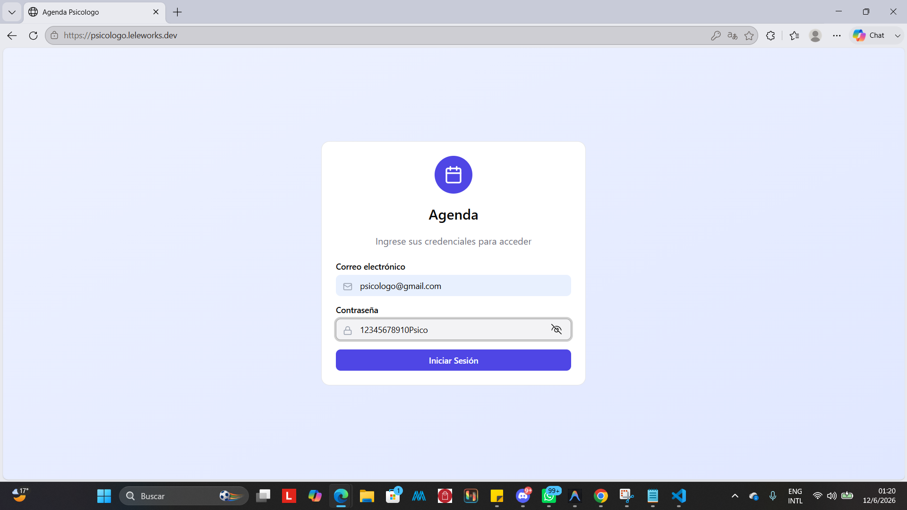
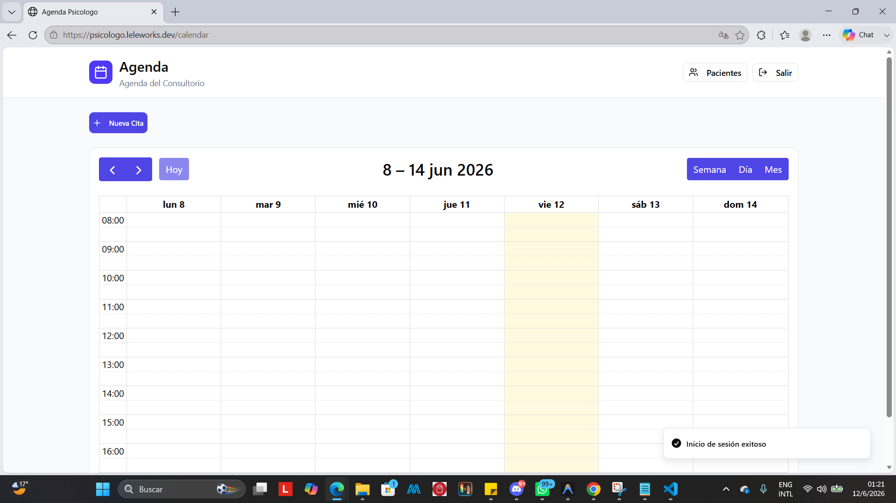
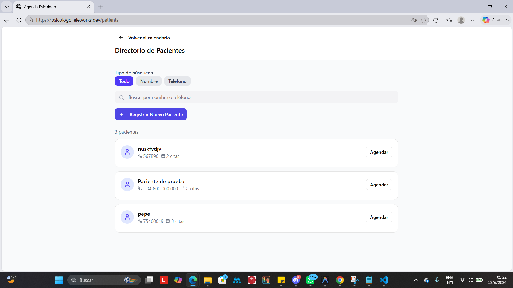
Seccion 2--Pruebas con TDD + cobertura
cobertura inicial(esto depues de ec2)
Herramienta: Vitest / Istanbul npx vitest run --coverage

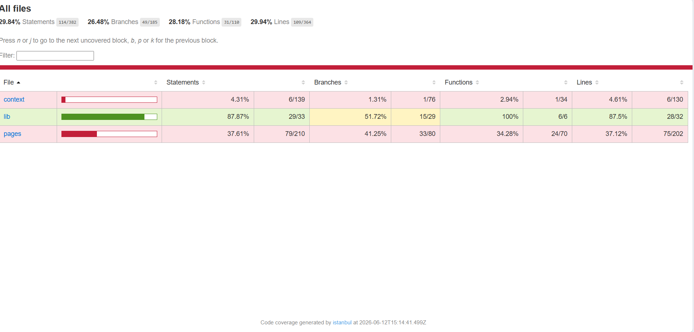
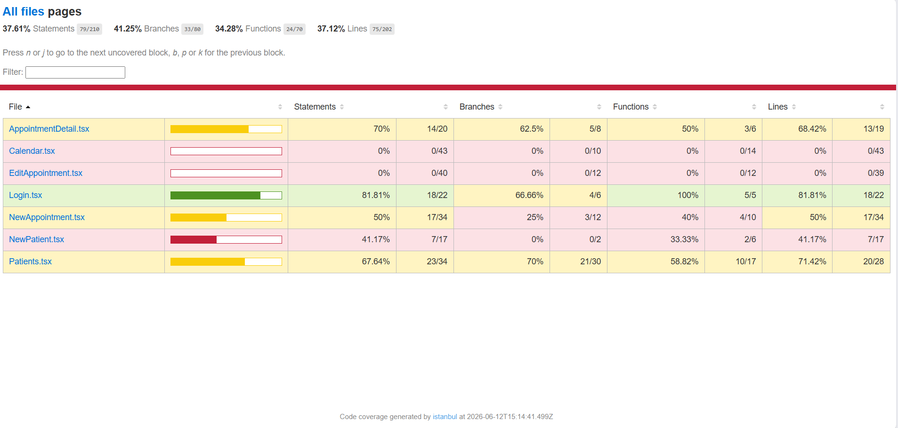

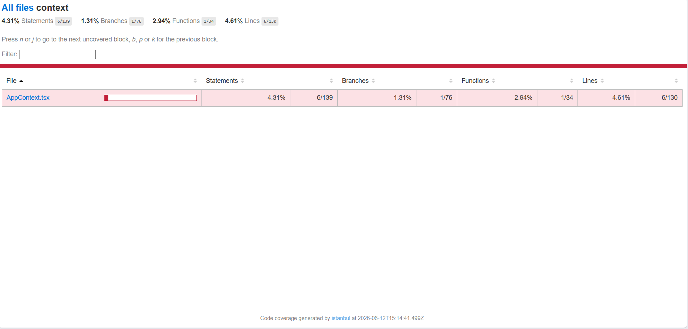
2.1 Ciclo TDD 1 — HU-08 (Cruce de horarios)
primero atacaremos a lo que es los cruces de horarios en las citas para eso creamos nuestro archivo timeUtils.test.ts crearemos un test pero siguiendo los principios de tdd haremos que falle 

Como psicólogo quiero que el sistema detecte si dos citas se superponen para evitar programar pacientes en el mismo horario.

CA elegido: “Si el inicio de una franja cae dentro de otra, el sistema devuelve que hay conflicto (true).

2.1.1. Prueba roja
como lo planeado fallo la prueba
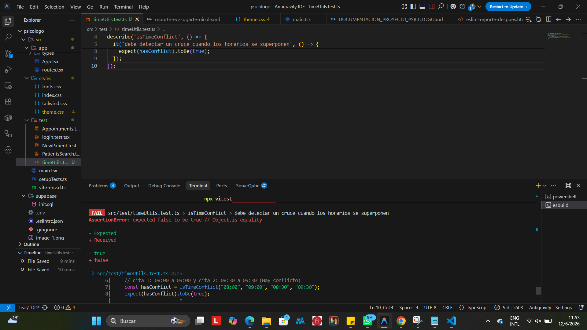
commit 1 Rojo [a92f591] https://github.com/nicoleUg/psicologo/commit/a92f591d51019cd2ddb736af746ee5a7e4836000 
test: [HU-08] agregar test para validacion de cruce de horarios
```typescript
import { describe, it, expect } from 'vitest';
import { isTimeConflict, timeToMinutes } from '../app/lib/timeUtils';

describe('isTimeConflict', () => {
  it('debe detectar un cruce cuando los horarios se superponen', () => {
    // cita 1: 08:00 a 09:00 y cita 2: 08:30 a 09:30 (Hay conflicto)
    const hasConflict = isTimeConflict("08:00", "09:00", "08:30", "09:30");
    expect(hasConflict).toBe(true);
  });
});'
```
2.1.2 Fase en verde 
como lo planeado paso el test
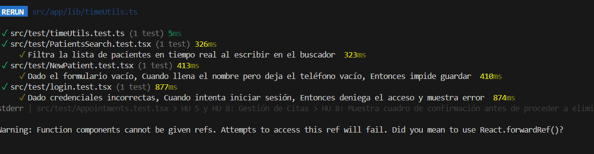
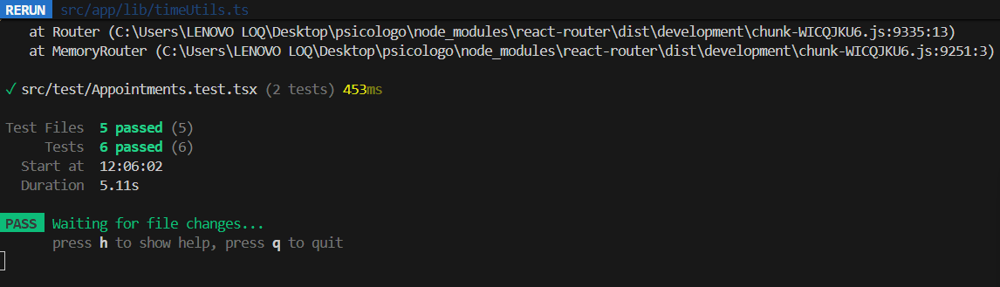
commit 2 Verde [abbdd1b] https://github.com/nicoleUg/psicologo/commit/abbdd1b58b8f9c250042a8ad6c761eb44cba601b 
feat: [HU-08] implementar isTimeConflict para pasar test
```typescript
export function isTimeConflict(start1: string, end1: string, start2: string, end2: string): boolean {
  const s1 = timeToMinutes(start1);
  const e1 = timeToMinutes(end1);
  const s2 = timeToMinutes(start2);
  const e2 = timeToMinutes(end2);
  
  if (s1 < e2 && s2 < e1) {
    return true;
  }
  return false;
}
```
2.1.3 Refactorizacion 
refactor al codigo para que sea mas  legible e entendible 
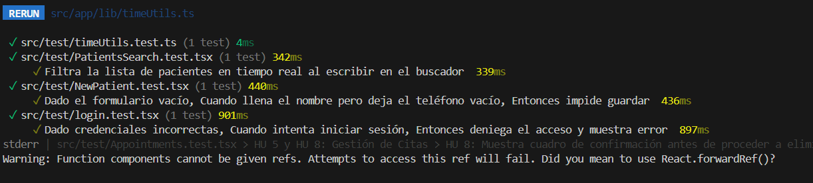
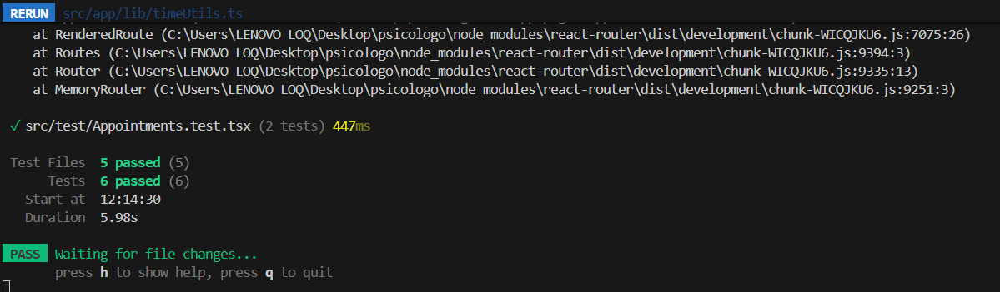
commit 3 refactorizacion [ec07f48] https://github.com/nicoleUg/psicologo/commit/ec07f48b55423d4b83f4388491a1e2630cd23870 
refactor: [HU-08] simplificar retorno booleano en isTimeConflict
```typescript
export function isTimeConflict(start1: string, end1: string, start2: string, end2: string): boolean {
  return timeToMinutes(start1) < timeToMinutes(end2) && timeToMinutes(start2) < timeToMinutes(end1);
}

```
2.2 HU-11:Validacion de telefono movil 
Como sistema requiero validar que los teléfonos ingresados tengan formato válido de celular para asegurar el contacto con el paciente.

CA elegido: Dado un número de teléfono, el sistema debe retornar verdadero si tiene el prefijo +591 seguido de un 6 o 7 y la longitud correcta, rechazando formatos inválidos.

2.2.1 Prueba roja
como se esperaba fallo
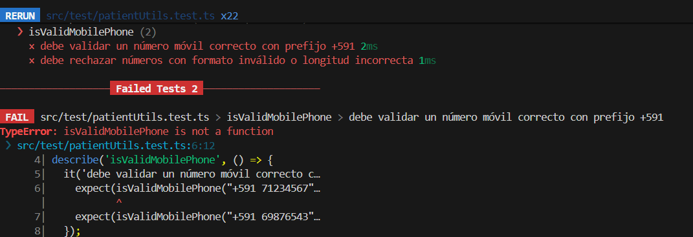
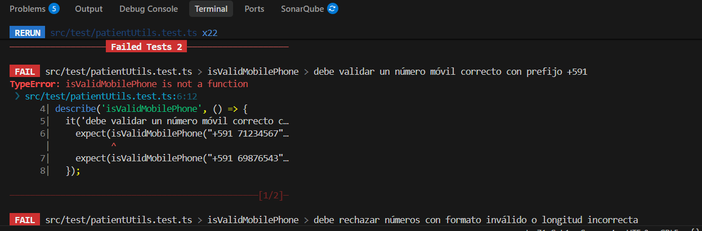
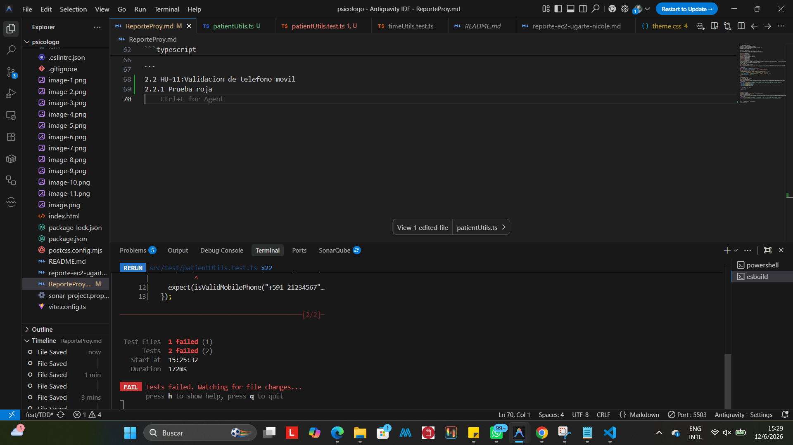
commit 1 Rojo [39dd26d] https://github.com/nicoleUg/psicologo/commit/39dd26d1b08c0f21828c7cc05d58eb6af0d75e94 
test: [HU-11] agregar test para validacion de telefono de paciente
```typescript

describe('isValidMobilePhone', () => {
  it('debe validar un número móvil correcto con prefijo +591', () => {
    expect(isValidMobilePhone("+591 71234567")).toBe(true);
    expect(isValidMobilePhone("+591 69876543")).toBe(true);
  });

  it('debe rechazar números con formato inválido o longitud incorrecta', () => {
    expect(isValidMobilePhone("12345")).toBe(false); 
    expect(isValidMobilePhone("+591 21234567")).toBe(false); 
  });
});
```
2.2.2 prueba verde 
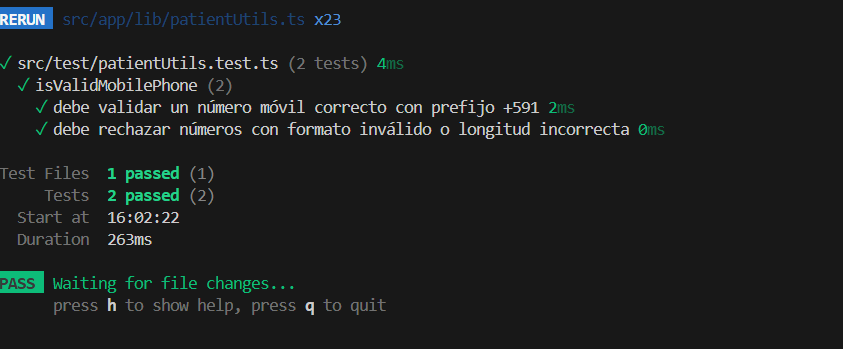
como se esperaba paso el test
commit verde [1193b01] https://github.com/nicoleUg/psicologo/commit/1193b01da0d521b50969886467db3e89e365a5fa 
feat: [HU-11] implementar isValidMobilePhone para pasar test
```typescript
export function isValidMobilePhone(phone: string): boolean {
  if (phone.includes("+591 7") || phone.includes("+591 6")) {
    return true;
  }
  return false;
}
```
2.2.3 Refactor 
refactor al codigo para que sea mas  legible e entendible 
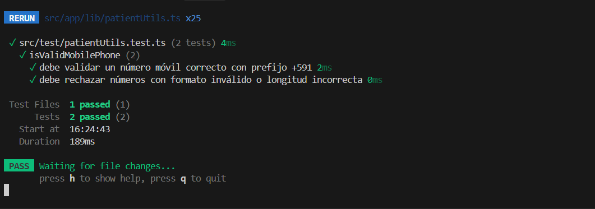
commit refactor [faa23f9] https://github.com/nicoleUg/psicologo/commit/faa23f9033528db97d1b675aab3ddfcc8c4ae329 
refactor: [HU-11] usar regex estricta en validacion de telefono
```typescript

export function isValidMobilePhone(phone: string): boolean {
  const normalized = phone.replace(/\s/g, '');
  const phoneRegex = /^\+591[67]\d{7}$/;
  return phoneRegex.test(normalized);
}
```
2.3 HU-12: Validación de Nombre Completo 
Como recepcionista quiero que el sistema me obligue a ingresar al menos nombre y apellido para no tener registros incompletos.

CA elegido: Dado un string de entrada, la función debe verificar que contenga al menos dos palabras separadas por espacio.

2.3.1 Prueba roja 
fallo 
commit rojo [8e8ce32] https://github.com/nicoleUg/psicologo/commit/8e8ce323d09203b414ad38d678abff04da135e93 
test: [HU-12] agregar test para longitud minima del nombre del paciente
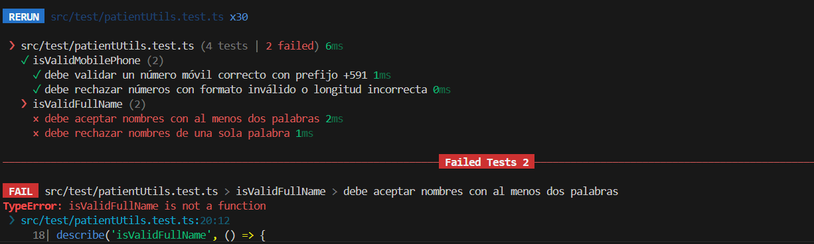
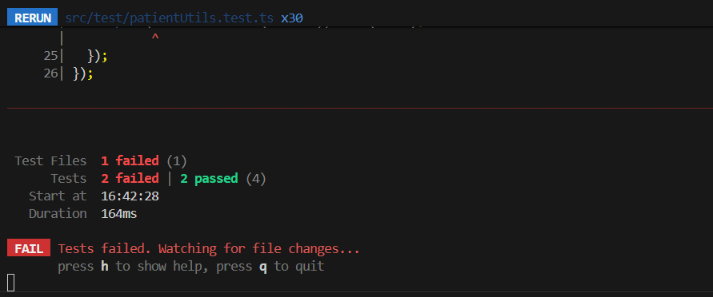
```typescript
describe('isValidFullName', () => {
  it('debe aceptar nombres con al menos dos palabras', () => {
    expect(isValidFullName("Maria Quispe")).toBe(true);
  });

  it('debe rechazar nombres de una sola palabra', () => {
    expect(isValidFullName("Maria")).toBe(false);
  });
});
```
2.3.2 prueba verde 
commit verde [4efcf92] https://github.com/nicoleUg/psicologo/commit/4efcf924b22a6455d7708d183d412f751c8657ac
feat: [HU-12] implementar split para validar nombre completo
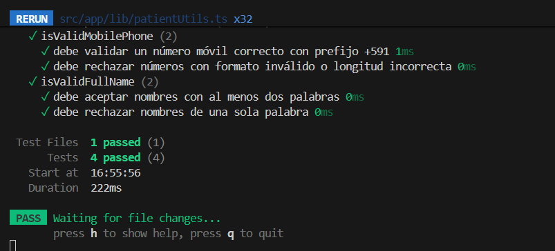
```typescript
export function isValidFullName(name: string): boolean {
  const parts = name.split(' ');
  if (parts.length >= 2) {
    return true;
  }
  return false;
}
```

2.3.3 refactor 
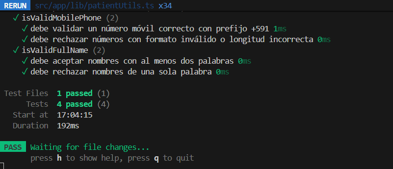
commit refactor [d21a590] https://github.com/nicoleUg/psicologo/commit/d21a5900c00a57b342744b32bc51fccaa17c2b2d
refactor: [HU-12] sanear espacios en blanco al validar nombre completo
```typescript
export function isValidFullName(name: string): boolean {
  if (!name) return false;
  const words = name.trim().split(/\s+/);
  return words.length >= 2;
}
```
coverage final 
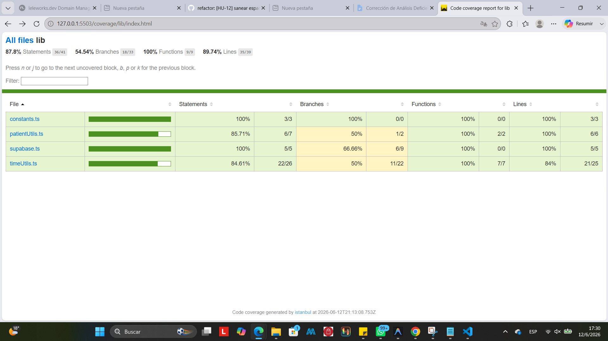
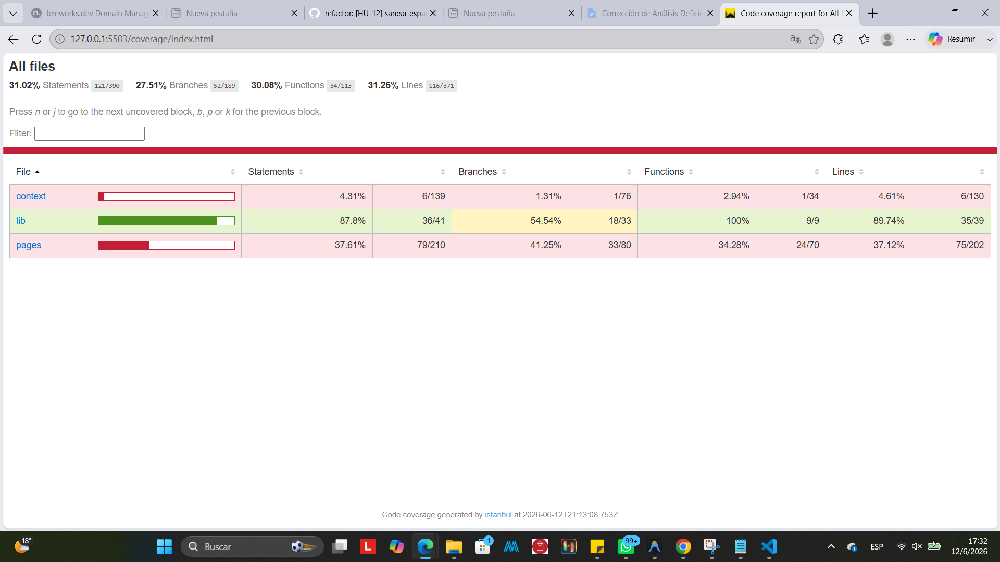
La corbertura final se encuentra en un 87.8% donde directamente atacamos a la logica de negocios en la carpeta lib, ya que anteriormente hice pruebas de integracion por esa razon se llega a mostrar las otras carpetas 

Seccion 3 --Code Smells corregidos 
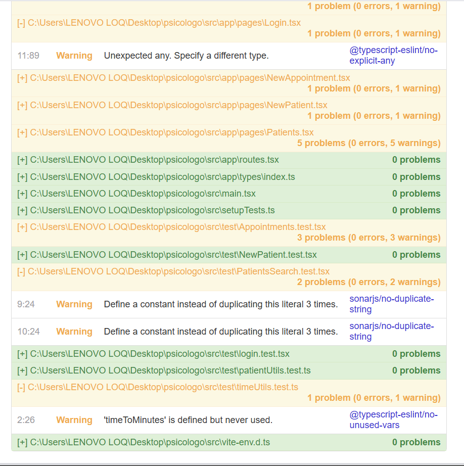
| # | Tipo | Commit | Descripción |
|---|---|---|---|
| 1 | [Inseguridad de Tipos (Uso de any)] | [`8741bfe`](https://github.com/nicoleUg/psicologo/commit/8741bfee9711bac51f3e70c7af0a73be94f2e1eb) | [Antes: Componente recibía props como any perdiendo el tipado. → Después: Se creó una interfaz LoginFormProps para tipado estricto.] |
| 2 | [Magic Strings / Duplicación de literales] | [`8ded2df`](https://github.com/nicoleUg/psicologo/commit/8ded2df92f058850c3cbc92425cc3f2aeaf877e6) | [Antes: Cadenas de texto repetidas en aserciones de prueba. → Después: Extracción de strings a variables constantes.] |
| 3 | [Dead Code (Imports sin usar)] | [`e8868a7`](https://github.com/nicoleUg/psicologo/commit/e8868a7c26f6a60da44dd5e6255f5e649de23733) | [Antes: Importación innecesaria que generaba advertencias del linter. → Después: Eliminación del código muerto.] |

Detalle — Smell 1: Inseguridad de Tipos (Uso de any)
Código antes (src/app/pages/Login.tsx):
```typescript
function LoginForm({ email, setEmail, password, setPassword, isLoading, handleSubmit }: any) {
  return (
    <form onSubmit={handleSubmit} className="space-y-4">
      // {...}
    </form>
  );
}
```
Código después (src/app/pages/Login.tsx):
```typescript
interface LoginFormProps {
  email: string;
  setEmail: (value: string) => void;
  password: string;
  setPassword: (value: string) => void;
  isLoading: boolean;
  handleSubmit: (e: React.FormEvent) => void;
}

function LoginForm({ email, setEmail, password, setPassword, isLoading, handleSubmit }: LoginFormProps) {
  return (
    <form onSubmit={handleSubmit} className="space-y-4">
      //{...}
    </form>
  );
}
```
Detalle — Smell 2: Magic Strings / Duplicación de literales
Código antes (src/test/PatientsSearch.test.tsx):
```typescript
const mockPatients = [
  { id: '1', fullName: 'Maria Quispe Mamani', phone: '+591 7123 4567' },
  { id: '2', fullName: 'Juan Choque Flores', phone: '+591 7214 5678' },
];

describe('HU 9: Búsqueda avanzada de pacientes', () => {
  it('Filtra la lista de pacientes...', async () => {
    // ...
    expect(screen.getByText('Maria Quispe Mamani')).toBeInTheDocument();
    expect(screen.getByText('Juan Choque Flores')).toBeInTheDocument();
    // ...
    expect(screen.queryByText('Maria Quispe Mamani')).not.toBeInTheDocument();
    expect(screen.getByText('Juan Choque Flores')).toBeInTheDocument();
  });
});
```

Código después (src/test/PatientsSearch.test.tsx):

```typescript
const PATIENT_MARIA = 'Maria Quispe Mamani';
const PATIENT_JUAN = 'Juan Choque Flores';

const mockPatients = [
  { id: '1', fullName: PATIENT_MARIA, phone: '+591 7123 4567' },
  { id: '2', fullName: PATIENT_JUAN, phone: '+591 7214 5678' },
];

describe('HU 9: Búsqueda avanzada de pacientes', () => {
  it('Filtra la lista de pacientes...', async () => {
    // ...
    expect(screen.getByText(PATIENT_MARIA)).toBeInTheDocument();
    expect(screen.getByText(PATIENT_JUAN)).toBeInTheDocument();
    // ...
    expect(screen.queryByText(PATIENT_MARIA)).not.toBeInTheDocument();
    expect(screen.getByText(PATIENT_JUAN)).toBeInTheDocument();
  });
});
```
Detalle — Smell 3: Dead Code (Imports sin usar)
Código antes (src/test/timeUtils.test.ts):

```TypeScript
import { describe, it, expect } from 'vitest';
import { isTimeConflict, timeToMinutes } from '../app/lib/timeUtils';

describe('isTimeConflict', () => {
  it('debe detectar un cruce cuando los horarios se superponen', () => {
    const hasConflict = isTimeConflict("08:00", "09:00", "08:30", "09:30");
    expect(hasConflict).toBe(true);
  });
});
```
Código después (src/test/timeUtils.test.ts):

```TypeScript
import { describe, it, expect } from 'vitest';
import { isTimeConflict } from '../app/lib/timeUtils';

describe('isTimeConflict', () => {
  it('debe detectar un cruce cuando los horarios se superponen', () => {
    const hasConflict = isTimeConflict("08:00", "09:00", "08:30", "09:30");
    expect(hasConflict).toBe(true);
  });
});
Código después (src/test/timeUtils.test.ts):
```
Sección 4 — Trazabilidad HU → CA → test
| # | Historia de Usuario | Criterio de Aceptación | Prueba que valida ese CA | Commit |
|---|---|---|---|---|
| 1 | [[HU-08] Validación de cruce de horarios]  | [Dado un horario guardado / Cuando agendo una cita que se superpone / Entonces retorna conflicto] | [isTimeConflict_HorariosSuperpuestos_RetornaTrue] | [`ec07f48`](https://github.com/nicoleUg/psicologo/commit/ec07f48b55423d4b83f4388491a1e2630cd23870) |
| 2 | [HU-11] Validación de teléfono móvil | [Dado un formulario / Cuando ingreso un teléfono sin formato boliviano / Entonces el sistema lo rechaza] | [isValidMobilePhone_FormatoInvalido_RetornaFalse] | [`faa23f9`](https://github.com/nicoleUg/psicologo/commit/faa23f9033528db97d1b675aab3ddfcc8c4ae329) |
| 3 | [HU-12] Validación de nombre completo | [Dado el campo nombre / Cuando introduzco una sola palabra / Entonces la validación falla] | [isValidFullName_UnaSolaPalabra_RetornaFalse] | [`d21a590`](https://github.com/nicoleUg/psicologo/commit/d21a5900c00a57b342744b32bc51fccaa17c2b2d) |

Cadena 1 — [HU-08] Validación de cruce de horarios
Historia de Usuario:

Como [psicólogo] quiero que el [sistema detecte si dos citas se superponen] para [evitar programar pacientes en el mismo horario].

Criterio de Aceptación elegido:

Dado un [horario previamente guardado en el sistema ("08:00"-"09:00")] / Cuando intento agendar una [nueva cita que inicia dentro de ese rango ("08:30"-"09:30")] / Entonces [el validador retorna "true" indicando que hay un conflicto].

Prueba que valida este CA:
```typescript
describe('isTimeConflict', () => {
  it('debe detectar un cruce cuando los horarios se superponen', () => {
    // cita 1: 08:00 a 09:00 y cita 2: 08:30 a 09:30 (Hay conflicto)
    const hasConflict = isTimeConflict("08:00", "09:00", "08:30", "09:30");
    expect(hasConflict).toBe(true);
  });
});
```
Cadena 2 — [HU-11] Validación de teléfono móvil
Historia de Usuario:

Como [psicólogo] quiero que el [sistema valide el número de teléfono] para [evitar errores en el registro de pacientes].

Criterio de Aceptación elegido:

Dado un [formulario de registro] / Cuando ingreso un [teléfono sin formato de bolivia (ej: "71234567") ] / Entonces [el validador falla y muestra un mensaje de error, impidiendo el envío de datos].

Prueba que valida este CA:
```typescript
describe('isValidMobilePhone', () => {
  it('debe validar un número móvil correcto con prefijo +591', () => {
    expect(isValidMobilePhone("+591 71234567")).toBe(true);
    expect(isValidMobilePhone("+591 69876543")).toBe(true);
  });

  it('debe rechazar números con formato inválido o longitud incorrecta', () => {
    expect(isValidMobilePhone("12345")).toBe(false); 
    expect(isValidMobilePhone("+591 21234567")).toBe(false); 
  });
});
```
Cadena 3 — [HU-12] Validación de nombre completo
Historia de Usuario:

Como [psicólogo] quiero [validar el nombre completo de los pacientes] para [no tener registros incompletos].

Criterio de Aceptación elegido:

Dado el [campo de texto para el nombre del paciente] / Cuando introduzco [una sola palabra (ejemplo: "Ana")] / Entonces [lEntonces la función de validación retorna falso].

Prueba que valida este CA:
```typescript
describe('isValidFullName', () => {
  it('debe validar un nombre completo con al menos dos palabras', () => {
    expect(isValidFullName("Maria Quispe Mamani")).toBe(true);
  });

  it('debe rechazar nombres que consisten en una sola palabra', () => {
    expect(isValidFullName("Ana")).toBe(false); 
    expect(isValidFullName("Juan")).toBe(false); 
  });
});
```